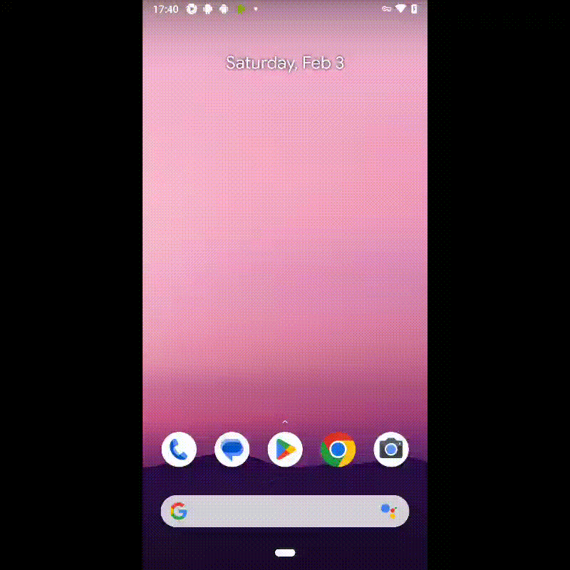

<h1 >Проект по автоматизации тестирования мобильного приложения <a href="https://github.com/wikimedia/apps-android-wikipedia/">Wikipedia</a></h1>
<p align="center">  
</a>  
</p>


## :scroll: Содержание:

- <a href="#tools">Технологии и инструменты</a>
- <a href="#checking">Список проверок, реализованных в автоматизированных тест-кейсах</a>
- <a href="#console">Запуск тестов (Из терминала)</a>
- <a href="#jenkins">Сборка в Jenkins</a>
- <a href="#allure">Allure-отчет</a>
- <a href="#allure-testops">Интеграция с Allure TestOps</a>
- <a href="#jira">Интеграция с Jira</a>
- <a href="#tg"> Уведомление в Telegram о результатах выполнения автоматизированных тестов</a>
- <a href="#movie">Видеопример прохождения тестов Browserstack</a>

____
<a id="tools"></a>

## 🔨 Технологии и инструменты:
<p align="center">
<a href="https://www.java.com/"></a>
<a href="https://appium.io/docs/en/2.4/"></a>
<a href="https://aerokube.com/selenoid/"></a>
<a href="https://github.com/allure-framework/allure2"></a>
<a href="https://qameta.io/"></a>
<a href="https://gradle.org/"></a>
<a href="https://junit.org/junit5/"></a>
<a href="https://github.com/"></a>
<a href="https://www.jenkins.io/"></a>
<a href="https://web.telegram.org/a/"></a>
<a href="https://www.atlassian.com/ru/software/jira/"></a>
<a href="https://www.browserstack.com/"></a>
</p>

## 🏁 Реализованные проверки:

### При запуске локально (local) на эмуляторе:

- ✓ *Проверка 4 стартовых страниц wiki*
- ✓ *Проверка добавления языка*
- ✓ *Проверка поиска конкретной статьи*
- ✓ *Проверка отображения иконки страници при поисковом запросе*


____
### При запуске удаленно (remote) на Browserstack:

- ✓ *Проверка появления результатов поиска при выдаче*
- ✓ *Проверка отображения значка ошибки при переходе на статью*
- ✓ *Проверка наличия заголовка*


## 🚀 Команда для запуска автотестов из терминала

Запуск локально (local) на эмуляторе:
```bash 
gradle clean local_test -DdeviceHost=local
```
> Для запуска локальных тестов на компьютере должны быть установлены Android Studio, Appium Server и Appium

Запуск удаленно (remote) на Browserstack:
```bash 
gradle clean remote_test -DdeviceHost=remote
```
____
<a id="jenkins"></a>
## </a><a name="Сборка"></a>Сборка в [Jenkins](https://jenkins.autotests.cloud/job/BankOTP/)</a>
<p align="center">  
<a href="https://jenkins.autotests.cloud/job/BankOTP/"></a>  
</p>

<a id="allure"></a>
## </a> Allure <a target="_blank" href="https://jenkins.autotests.cloud/job/wiki_project/allure/">отчёт</a>

### *Основная страница отчёта*

<p align="center">  
  
</p>  

<a id="allure-testops"></a>
## </a>Интеграция с <a target="_blank" href="https://allure.autotests.cloud/project/3879/dashboards">Allure TestOps</a>
### *Allure TestOps Dashboard*

<p align="center">  
  
</p>  


<a id="telegram"></a>
## </a>Уведомление в Telegram

<p align="center">  
  
</p>

____
<a id="movie"></a>
## </a> Видеопример выполнения теста Browserstack

____
<p align="center">
   
</p>